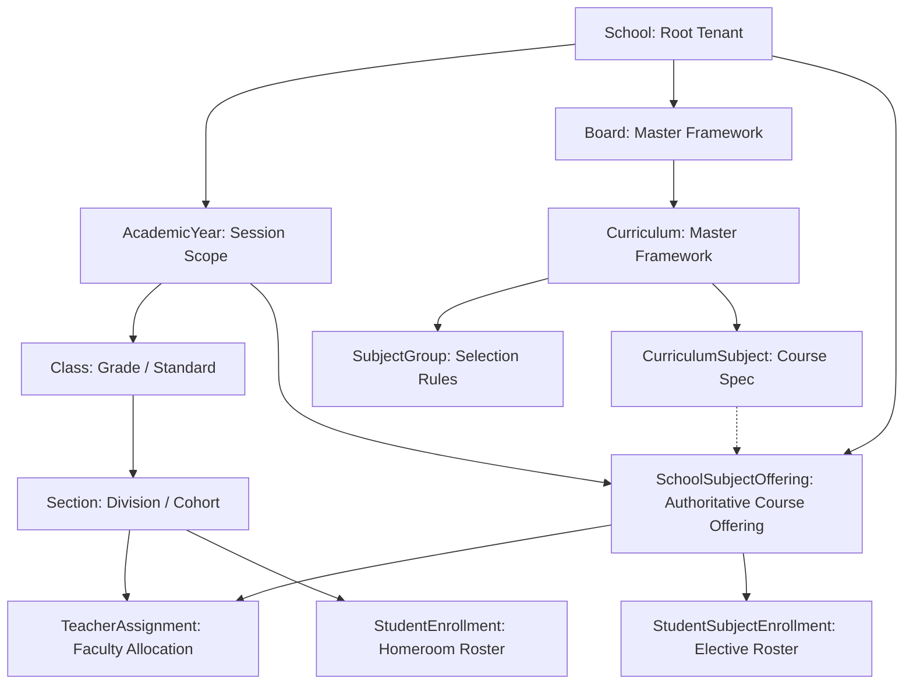

# Academic Foundation Audit & Canonical Data Model
**Document Version:** 1.0.0  
**Change Reference:** Change #8D (Architectural Audit & Baseline)  
**Status:** Approved Architectural Baseline  
**Scope:** Architecture & Data Model Audit (Zero Schema Migrations in 8D)  
**Target Repository:** `agentic-school-erp`  

---

## 1. Executive Summary & Objective

The primary objective of Change #8D is to thoroughly audit the academic foundation of the School ERP system, resolve ambiguities across overlapping entities, establish an authoritative canonical data model, and define strict cross-table invariants **prior** to executing database migrations in Change #8E.

### The Core Architectural Question
> **Which academic model is the authoritative source of truth for every future academic feature?**

Historically, the system evolved with a dual-layer representation:
1. An early legacy layer (`Subject`, `ClassSubject`, unconstrained `TeacherAssignment`) designed for simple CRUD.
2. An advanced national framework layer (`Board`, `Curriculum`, `SubjectGroup`, `GlobalSubject`, `CurriculumSubject`, `SchoolSubjectOffering`, `StudentSubjectEnrollment`) built to support Indian educational boards (CBSE, CISCE, State Boards) and NEP 2020 multi-disciplinary standards.

This audit establishes the **Target Canonical Hierarchy**:
```
School (Tenant Root)
  └── AcademicYear (School-Scoped Temporal Context)
        └── Board & Curriculum (Global Reference Catalog / Board Framework)
              └── Class / Grade (School + Year Standard, e.g., Grade 10)
                    └── Section (Operational Cohort, e.g., Section A)
                          └── SchoolSubjectOffering (Authoritative Course Offering for Year & Grade)
                                ├── TeacherAssignment (Staff allocated to Section + Offering for Year)
                                └── StudentEnrollment
                                      ├── StudentEnrollment (Class/Section Cohort Roster)
                                      └── StudentSubjectEnrollment (Specific Elective/Language Courses)
```

---

## 2. Inventory & Classification of Academic Models

Every entity touching the academic lifecycle in `apps/api/prisma/schema.prisma` is classified into exactly one architectural category:
- **CANONICAL**: Authoritative future source of truth.
- **LEGACY**: Historical representation to be phased out via adapters.
- **BRIDGE / COMPATIBILITY**: Temporary connector facilitating smooth transition without breaking downstream modules.
- **REFERENCE / MASTER**: Globally shared catalog data (not school transactional data).
- **DUPLICATE / REDUNDANT**: Overlaps another model without distinct long-term utility.
- **UNCERTAIN**: Used only when evidence is insufficient (none remain uncertain).

### Academic Model Classification Table

| Entity | Table Name | Scope | Classification | Description & Authoritative Role |
| :--- | :--- | :--- | :--- | :--- |
| **`AcademicYear`** | `academic_years` | School-Scoped | **CANONICAL** | Authoritative temporal boundary for all academic terms, sessions, fees, exams, and offerings. |
| **`Class`** | `classes` | School + Year | **CANONICAL** | Authoritative standard/grade entity. Contains `numericLevel` (1–12) for grade ordering. |
| **`Section`** | `sections` | Class-Scoped | **CANONICAL** | Authoritative student grouping/division within a class (e.g., Section A). Inherits School and Year via Class. |
| **`GlobalSubject`** | `global_subjects` | Global | **REFERENCE / MASTER** | Authoritative global catalog of standardized subjects across all boards (e.g., English, Mathematics, Physical Science). |
| **`Board`** | `boards` | Global | **REFERENCE / MASTER** | Authoritative regulatory education boards (CBSE, CISCE, AP SSC, TS SSC, IB, Cambridge). |
| **`Curriculum`** | `curriculums` | Board-Scoped | **REFERENCE / MASTER** | Authoritative versioned framework for a board (e.g., CBSE 2026-27, ICSE 2026-27). |
| **`SubjectGroup`** | `subject_groups` | Curriculum-Scoped | **REFERENCE / MASTER** | Grouping rules within a curriculum (e.g., Compulsory Languages, Core Academics, Skill Subjects). |
| **`CurriculumSubject`** | `curriculum_subjects` | Curriculum-Scoped | **REFERENCE / MASTER** | Official board course definition with course code, grade span (`gradeFrom`–`gradeTo`), and assessment split. |
| **`SchoolSubjectOffering`** | `school_subject_offerings` | School + Year | **CANONICAL** | **Authoritative source of truth** for what courses a school offers in a specific academic year and grade level. |
| **`Subject`** | `subjects` | School-Scoped | **LEGACY** | Old school-scoped subject table. Still referenced by Exams, Timetable, Assignments. Bridged via `legacySubjectId`. |
| **`ClassSubject`** | `class_subjects` | Class-Scoped | **DUPLICATE / REDUNDANT** | N:M join table linking `Class` to legacy `Subject`. Completely redundant with grade-banded `SchoolSubjectOffering`. |
| **`StudentEnrollment`** | `student_enrollments` | Section-Scoped | **CANONICAL** | Authoritative student class/cohort membership (Student ↔ Section). Inherits Year and School via Class. |
| **`StudentSubjectEnrollment`** | `student_subject_enrollments` | Student + Offering | **CANONICAL** | Authoritative student-level course enrollment (especially for 2nd/3rd languages, electives, and vocational courses). |
| **`TeacherAssignment`** | `teacher_assignments` | Staff + Section | **BRIDGE / COMPATIBILITY** | Current model links `Staff` to `Section` and legacy `Subject`. Needs hardening to become CANONICAL in 8E. |

### Supporting Non-Academic Master Entities
- **`School`**: Root tenant boundary. Contains `boardId` and `activeCurriculumId`.
- **`Department`**: Organizational administrative grouping for staff (e.g., Science Dept, Humanities Dept). Secondary relation to timetable/sections.
- **`Staff`**: Employee entity; teachers are `Staff` with role `TEACHER`.
- **`Student`**: Core learner entity scoped to `School`.

---

## 3. Model Responsibility Matrix

| Model | Current Responsibility | Current Owner | Tenant Scope | Academic-Year Scope | Referenced By | Classification | Target Responsibility | Migration Risk |
| :--- | :--- | :--- | :--- | :--- | :--- | :--- | :--- | :--- |
| **`AcademicYear`** | Session start/end dates, active status | School Admin | `schoolId` | Self | Class, Exam, Timetable, FeeStructure, Promotion, Admission | **CANONICAL** | Authoritative temporal context for all academic records. | Low |
| **`Class`** | Grade/Standard container | School Admin | `schoolId` | `academicYearId` | Section, TimetableSlot, Assignment, ClassSubject | **CANONICAL** | Authoritative grade-level container per session. | Low |
| **`Section`** | Class division, room, capacity | School Admin | Via `Class` | Via `Class` | StudentEnrollment, TeacherAssignment, TimetableSlot, AttendanceRecord | **CANONICAL** | Authoritative physical cohort/classroom unit. | Low |
| **`Board`** | Master board catalog | Super Admin | Global | Global | School, Curriculum | **REFERENCE / MASTER** | Reusable board standard metadata. | None |
| **`Curriculum`** | Versioned syllabus framework | Super Admin | Global | Versioned (e.g., 2026) | Board, SubjectGroup, CurriculumSubject, SchoolSubjectOffering | **REFERENCE / MASTER** | Master curriculum structure. | None |
| **`SubjectGroup`** | Rules for subject selection | Super Admin | Global | Curriculum-Scoped | CurriculumSubject | **REFERENCE / MASTER** | Master rules for mandatory vs. elective baskets. | None |
| **`GlobalSubject`** | Universal subject identity | Super Admin | Global | Universal | CurriculumSubject, SchoolSubjectOffering | **REFERENCE / MASTER** | Normalized subject taxonomy. | None |
| **`CurriculumSubject`** | Board course specification | Super Admin | Global | Curriculum-Scoped | SchoolSubjectOffering | **REFERENCE / MASTER** | Syllabus definition and evaluation blueprint. | None |
| **`SchoolSubjectOffering`** | Actual courses offered by a school | Academic Coordinator | `schoolId` | `academicYearId` | StudentSubjectEnrollment | **CANONICAL** | **Authoritative source of truth** for course scheduling, evaluation, and enrollment. | High (Legacy bridge required) |
| **`Subject`** | Flat school subject list | Academic Admin | `schoolId` | None (Unscoped) | ExamSubject, TimetableSlot, Assignment, TeacherAssignment, ClassSubject | **LEGACY** | Maintained solely as a compatibility adapter until modules migrate to offerings. | High |
| **`ClassSubject`** | Map Class to Subject | Academic Admin | Via `Class` | Via `Class` | None (read only) | **DUPLICATE / REDUNDANT** | Deprecated. Replaced by querying `SchoolSubjectOffering` for grade range. | Medium |
| **`StudentEnrollment`** | Student class/section assignment | Registrar | Via `Section` | Via `Section` -> `Class` | StudentPromotion | **CANONICAL** | Primary cohort assignment (homeroom/section). | Medium |
| **`StudentSubjectEnrollment`** | Elective/language choices | Academic Coordinator | Via Offering | `academicYearId` | Exam Marks, Report Cards | **CANONICAL** | Individual course enrollment for non-universal subjects. | Medium |
| **`TeacherAssignment`** | Teacher to Section/Subject | Timetable Incharge | Unscoped (no `schoolId`) | Loose string (`academicYearId`) | Timetable auto-generation | **BRIDGE / COMPATIBILITY** | In 8E: Re-anchor to `SchoolSubjectOffering`, enforce `schoolId` and compound keys. | High |

---

## 4. Authoritative Sources of Truth

### 4.1 Academic Year
- **Authoritative Entity:** `AcademicYear` (`schoolId`, `name`, `startDate`, `endDate`, `isActive`, `isLocked`).
- **Rule:** Exactly one `AcademicYear` should be active (`isActive = true`) per school at any given time.
- **Defect Identified:** Schema currently only indexes `@@index([schoolId, isActive])`. It allows multiple active years to exist simultaneously. Services rely on unconstrained `.findFirst({ where: { schoolId, isActive: true } })`.
- **Target Constraint for 8E:** Partial unique index or transactional invariant guaranteeing at most one active year per tenant.

### 4.2 Class / Grade Representation
- **Authoritative Entity:** `Class` (`schoolId`, `academicYearId`, `name`, `numericLevel`).
- **Audit Decision: DO NOT introduce a separate `Grade` entity.**
  - `Class.numericLevel` (integer 1 through 12) already stores the canonical grade ordinal.
  - Adding a separate `Grade` model would create a duplicate entity representing the same grade identity and introduce severe synchronization overhead.
  - `Class` represents the grade instance within an academic year (e.g., "Grade 10 - 2026-27").

### 4.3 Section
- **Authoritative Entity:** `Section` (`classId`, `name`, `capacity`, `roomNumber`).
- **Rule:** A section belongs to exactly one `Class`.
- **Context Flow:** `Section` → `Class` → `AcademicYear` → `School`.
- Every section strictly inherits tenant and year from its parent class.

### 4.4 Subject Identity Architecture
Subject identity is split into distinct concerns:
1. **Universal Taxonomy:** `GlobalSubject` (e.g., Code: `MAT`, Name: `Mathematics`). Master record, agnostic of board or school.
2. **Curriculum Course Specification:** `CurriculumSubject` (e.g., CBSE 10th Standard Mathematics, Code `041`, Grades 9–10, 80 Theory / 20 Internal). Master record, board-specific.
3. **Operational Course Offering:** `SchoolSubjectOffering` (e.g., Greenfield Academy offers CBSE Math 041 for Grade 10 in AY 2026-27). Tenant- and year-specific.
4. **Compatibility Facade:** `Subject` (Legacy school-scoped row). Retained solely so downstream modules (Exams, Assignments, Timetable) continue functioning without immediate refactoring.

---

## 5. Audit of Legacy `Subject` & `ClassSubject` Models

### 5.1 Consumers of Legacy `Subject`
A repository-wide inspection confirms that five critical modules currently query `Subject`:
1. **Exams Module (`ExamSubject`):**
   ```prisma
   model ExamSubject {
     subjectId String // Foreign key to Subject
     classId   String // Plain string (missing relation to Class)
     ...
   }
   ```
2. **Timetable Module (`TimetableSlot`):**
   ```prisma
   model TimetableSlot {
     subjectId String? // Foreign key to Subject
     ...
   }
   ```
3. **Assignments Module (`Assignment`):**
   ```prisma
   model Assignment {
     subjectId String // Foreign key to Subject
     ...
   }
   ```
4. **Staff / Teacher Module (`TeacherAssignment`):**
   ```prisma
   model TeacherAssignment {
     subjectId String? // Foreign key to Subject
     ...
   }
   ```
5. **Classes Module (`ClassSubject`):**
   ```prisma
   model ClassSubject {
     classId   String // Foreign key to Class
     subjectId String // Foreign key to Subject
   }
   ```

### 5.2 Information Delta
- Does legacy `Subject` contain unique business data? **No.**
  - `Subject` only has `id`, `schoolId`, `name`, `code`, `isElective`, `isActive`.
  - All of these fields (and much richer evaluation metadata like `theoryMarks`, `practicalMarks`, `periodsPerWeek`) are present in `SchoolSubjectOffering`.
- Does `ClassSubject` duplicate offering relationships? **Yes.**
  - `ClassSubject` is an unweighted join between `Class` and `Subject`.
  - `SchoolSubjectOffering` already specifies `gradeFrom` and `gradeTo`. A class of `numericLevel = 10` automatically matches offerings with `gradeFrom <= 10 && gradeTo >= 10`.
  - Currently, `CurriculumService.syncClassSubjects()` manually copies offerings into `ClassSubject` just to satisfy legacy readers!

### 5.3 Legacy Deprecation Pipeline
```
[Phase 1: Current Baseline (8D)]
  SchoolSubjectOffering.legacySubjectId ──(1:1 Bridge)──> Subject
  CurriculumService auto-creates legacy Subject on offering creation.

[Phase 2: Data Hardening (8E)]
  Ensure all SchoolSubjectOfferings have non-null legacySubjectId.
  Add composite index [schoolId, legacySubjectId].

[Phase 3: Service Adapters (8F)]
  Introduce SubjectOfferingAdapter: when an API asks for "subjects",
  read from SchoolSubjectOffering and format as legacy Subject DTO.

[Phase 4: Module Migration (Future 8G+)]
  Migrate ExamSubject, TimetableSlot, Assignment to reference schoolSubjectOfferingId.

[Phase 5: Deprecation Notice]
  Mark prisma.subject and prisma.classSubject as @deprecated in schema.

[Phase 6: Removal]
  Drop legacy Subject and ClassSubject tables once zero foreign keys remain.
```

---

## 6. Academic-Year & Tenant Integrity Audit

A comprehensive review of foreign keys, compound indexes, and query patterns revealed several structural integrity vulnerabilities:

### 6.1 Vulnerability Matrix

| Area | Observed Schema / Code Pattern | Threat / Defect | Severity | Required 8E Action |
| :--- | :--- | :--- | :--- | :--- |
| **`AcademicYear` Active State** | `@@index([schoolId, isActive])` | Multiple academic years can have `isActive = true` simultaneously. Code falls back to `findFirst()`. | **P1 (Correctness)** | Enforce single active year invariant. |
| **`Class` Tenant Relation** | `schoolId String` without `@relation` to `School` | Relies on `academicYear.schoolId`. No direct DB cascade or FK constraint to `School`. | **P2 (Integrity)** | Add `@relation(fields: [schoolId], references: [id])`. |
| **`SchoolSubjectOffering` Isolation** | `academicYearId String` without `@relation` to `AcademicYear` | Orphaned offerings possible if an academic year is purged; no cross-table FK. | **P1 (Integrity)** | Add `@relation(fields: [academicYearId], references: [id])`. |
| **`TeacherAssignment` Multi-Tenancy** | Lacks `schoolId` completely | Staff from School A could theoretically be assigned to Section in School B if raw ID is supplied. | **P0 (Security)** | Add `schoolId String` with relation and composite index. |
| **`TeacherAssignment` Year Drift** | `academicYearId String` has no FK to `AcademicYear` | No referential integrity to session calendar. | **P1 (Integrity)** | Add `@relation(fields: [academicYearId], references: [id])`. |
| **`TeacherAssignment` Uniqueness Collision** | `@@unique([staffId, sectionId, subjectId])` | **Fatal Flaw:** Omits `academicYearId`. Teacher cannot be reassigned to the same class/subject across different years! | **P0 (Data Loss)** | Update unique constraint to `[academicYearId, staffId, sectionId, subjectId]`. |
| **`StudentEnrollment` Active Uniqueness** | `@@unique([studentId, sectionId])` | Student can have multiple active enrollments across different sections/classes in the same year. | **P1 (Integrity)** | Add active-status validation and single active enrollment constraint. |
| **`StudentSubjectEnrollment` Foreign Key** | `academicYearId String` has no FK to `AcademicYear` | No referential integrity to session calendar. | **P1 (Integrity)** | Add `@relation(fields: [academicYearId], references: [id])`. |
| **`ExamSubject` Missing Class FK** | `classId String` without relation to `Class` | Dangling class ID risk in exam syllabus. | **P2 (Cleanup)** | Add `@relation(fields: [classId], references: [id])`. |

---

## 7. Curriculum Architecture Audit

### 7.1 Entity Relationships
```
Board (Master: CBSE, CISCE, STATE_AP, STATE_TS)
  └── Curriculum (Master: CBSE_2026, version: "2026-27")
        ├── SubjectGroup (Master: Group I Compulsory, Electives)
        │     └── CurriculumSubject (Master: Code 041, Math, Grades 9-10)
        └── SchoolSubjectOffering (Tenant Operational: School + AcademicYear + Grade Span)
```

### 7.2 Key Architectural Attributes
1. **Board Scope:** Global master data. Not school-owned. Seeded via `curriculum-seed.service.ts`.
2. **Curriculum Scope:** Global master data. Represents a specific board syllabus release (e.g., `CBSE_2026` effective 2026-04-01 to 2027-03-31).
3. **School Binding:** A `School` connects to this hierarchy via `school.boardId` and `school.activeCurriculumId`.
4. **Grade Range Representation:** Grade spans are explicitly integer bounds: `gradeFrom` (1–12) and `gradeTo` (1–12).
   - Primary: 1–5
   - Middle: 6–8
   - Secondary: 9–10
   - Senior Secondary: 11–12
5. **Subject Selection Rules:** `SubjectGroup` defines `minSelection` and `maxSelection` with `isRequired: boolean`. `CurriculumSubject` defines `selectionType: SubjectSelectionType` (`MANDATORY`, `ELECTIVE`, `OPTIONAL`, `VOCATIONAL`).
6. **Marking Structures:** Built into both `CurriculumSubject` and `SchoolSubjectOffering`:
   - `theoryMarks`: Theory paper allocation (e.g., 80)
   - `practicalMarks`: Lab/practical evaluation (e.g., 20)
   - `internalMarks`: Continuous assessment
   - `maxMarks`: Total marks (typically 100)
   - `passMarks`: Benchmark (e.g., 33 or 35)

---

## 8. School Subject Offerings Audit

`SchoolSubjectOffering` is the operational heart of academic scheduling. It answers: *What courses does this school teach to which grade band during this academic year?*

### 8.1 Schema Verification
```prisma
model SchoolSubjectOffering {
  id                        String                @id @default(cuid())
  schoolId                  String
  curriculumId              String
  academicYearId            String
  curriculumSubjectId       String?               // Nullable if SCHOOL_CUSTOM
  globalSubjectId           String
  legacySubjectId           String?               // Direct backwards-compatibility bridge to Subject
  customName                String?
  customCode                String?
  source                    OfferingSource        @default(CURRICULUM) // CURRICULUM | SCHOOL_CUSTOM
  gradeFrom                 Int
  gradeTo                   Int
  periodsPerWeek            Int                   @default(5)
  isOffered                 Boolean               @default(true)
  subjectType               SubjectClassification @default(CORE)
  selectionType             SubjectSelectionType  @default(MANDATORY)
  theoryEnabled             Boolean               @default(true)
  practicalEnabled          Boolean               @default(false)
  internalAssessmentEnabled Boolean               @default(false)
  examEnabled               Boolean               @default(true)
  maxMarks                  Int                   @default(100)
  passMarks                 Int                   @default(35)
  metadata                  Json?                 @default("{}")
  createdAt                 DateTime              @default(now())
  updatedAt                 DateTime              @updatedAt
  ...
}
```

### 8.2 Audit Observations & Gaps
1. **Authoritative Status:** Accurately represents the operational course.
2. **Custom Subjects Supported:** When a school offers a custom course (e.g., "Robotics & AI" or "School Heritage"), `source = SCHOOL_CUSTOM`, `curriculumSubjectId = null`, and `customName`/`customCode` are utilized.
3. **Bridge Field Integrity:** `legacySubjectId` links to `Subject`. Currently, `CurriculumService` manually executes `prisma.subject.findFirst()` and `create()`. This must be formalized in Change #8E.
4. **Missing Index:** Missing composite foreign key to `AcademicYear(id)`.

---

## 9. Student Enrollment Audit

### 9.1 Concept Separation
There are two fundamentally different student enrollments in school operations:
1. **Class / Section Cohort Enrollment (`StudentEnrollment`):**
   - Represents physical room/cohort assignment (e.g., Student John is in Class 10, Section B for 2026-27).
   - Mandatory for all students.
   - Generates attendance registers, homeroom rosters, and fee billing tiers.
2. **Subject Course Enrollment (`StudentSubjectEnrollment`):**
   - Represents enrollment in a specific course offering.
   - For `MANDATORY` core courses (e.g., English, Math, Science), enrollment is automatic based on grade.
   - For `ELECTIVE`, `OPTIONAL`, and Language options (e.g., Sanskrit vs. French vs. Hindi; Computer Applications vs. Economics), explicit enrollment is required.

### 9.2 Identified Risks
- **Duplicate Active Enrollment:** A student could be enrolled in Section 10-A and Section 10-B simultaneously if `StudentEnrollment.status` is not checked.
- **Offering Grade Mismatch:** `StudentSubjectEnrollment` must validate that the student's class `numericLevel` falls between the offering's `gradeFrom` and `gradeTo`.

---

## 10. Teacher Assignment Audit

`TeacherAssignment` manages teacher deployment.

### 10.1 Identified Critical Defects
1. **Year Collisions:**
   The unique index is `@@unique([staffId, sectionId, subjectId])`. It **omits** `academicYearId`.
   *Result:* If Teacher Smith taught Math to 10-A in 2025, the system throws a DB conflict error when trying to assign Teacher Smith to 10-A in 2026!
2. **Cross-Tenant Risk:**
   `TeacherAssignment` lacks a `schoolId` column. Query patterns rely on traversing `section -> class -> schoolId`, creating security risks if raw IDs are supplied in multi-tenant operations.
3. **Legacy Binding:**
   Points to `subject Subject?` instead of `schoolSubjectOffering SchoolSubjectOffering?`.
4. **Class Teacher Ambiguity:**
   When `isClassTeacher = true`, `subjectId` is often set to `null` or the first subject in the section.

---

## 11. Repository Usage & Code Pattern Audit

We audited all `prisma.*` academic entity invocations across `apps/api/src`:

### Class P0: Security & Data Corruption Risks
- **`TeacherAssignment` unique constraint collision across academic years.** (Detailed in Section 10).
- **Tenant ID omission in `TeacherAssignment`.** (Detailed in Section 10).

### Class P1: Wrong Source of Truth & Correctness Risks
- **Multiple active academic years allowed by schema.** In `admissions.service.ts`, `classes.service.ts`, `exams.service.ts`, `fees.service.ts`, `curriculum.service.ts`, code repeatedly invokes:
  ```typescript
  const activeYear = await this.prisma.academicYear.findFirst({
    where: { schoolId, isActive: true },
  }) || await this.prisma.academicYear.findFirst({ where: { schoolId } });
  ```
  This is fragile. If two years are set to active, services pick an arbitrary year based on DB insertion order.
- **Sync Lag in `ClassSubject`:** `CurriculumService.syncClassSubjects()` must be called manually after modifying offerings; otherwise, timetable and exam dropdowns become out-of-sync with curriculum offerings.

### Class P2: Technical Cleanup & Redundancies
- Direct calls to `prisma.subject.findMany({ where: { schoolId, isActive: true } })` in `classes.service.ts` line 215. This returns unscoped legacy subjects without grade or academic-year awareness.

---

## 12. Canonical Academic Hierarchy



### Operational Invariant
A feature (Exam, Timetable, Attendance, Gradebook) should identify courses through **`SchoolSubjectOffering`**, faculty through **`TeacherAssignment`**, and learners through **`StudentEnrollment`** + **`StudentSubjectEnrollment`**.

---

## 13. Cross-Table Invariants for Change #8E

Change #8E must enforce the following database-level and application-level invariants:

1. **`AcademicYear` Invariants:**
   - Belongs to exactly one `School`.
   - `[schoolId, name]` must be unique.
   - `startDate < endDate`.
   - At most one `isActive = true` record per `schoolId`.
2. **`Class` Invariants:**
   - Belongs to one `School` and one `AcademicYear`.
   - `[schoolId, academicYearId, name]` must be unique.
   - `numericLevel` must be between 1 and 12 (or pre-K negative ordinals).
3. **`Section` Invariants:**
   - Belongs to one `Class`. Inherits `schoolId` and `academicYearId`.
   - `[classId, name]` must be unique.
4. **`CurriculumSubject` Invariants:**
   - Belongs to one `Curriculum`.
   - `gradeFrom <= gradeTo`.
   - `[curriculumId, subjectCode, gradeFrom, gradeTo]` must be unique.
5. **`SchoolSubjectOffering` Invariants:**
   - Belongs to one `School` and one `AcademicYear`.
   - `gradeFrom <= gradeTo`.
   - `[schoolId, academicYearId, globalSubjectId, gradeFrom, gradeTo]` must be unique.
   - Foreign key to `AcademicYear(id)` must be established with referential integrity.
6. **`StudentEnrollment` Invariants:**
   - Student's `schoolId` must match Section's `Class.schoolId`.
   - At most one `ACTIVE` enrollment per student per `academicYearId`.
7. **`StudentSubjectEnrollment` Invariants:**
   - Student's active class grade must satisfy: `offering.gradeFrom <= studentClass.numericLevel <= offering.gradeTo`.
   - `[studentId, schoolSubjectOfferingId, academicYearId]` must be unique.
8. **`TeacherAssignment` Invariants:**
   - Must include `schoolId` matching `staff.schoolId` and `section.class.schoolId`.
   - Must include FK to `AcademicYear(id)`.
   - Unique key must be updated to `[academicYearId, staffId, sectionId, subjectId]`.

---

## 14. Legacy Migration Strategy & Adapter Architecture

To prevent breaking existing modules, the transition follows a **Zero-Downtime Multi-Phase Strategy**:

```
[Phase 8D: Audit & Baseline] ──> [Phase 8E: Hardening & Invariants] ──> [Phase 8F: Canonical APIs] ──> [Phase 8G: Downstream Consumers]
```

1. **Keep `Subject` and `ClassSubject` in 8D and 8E:** No tables will be dropped.
2. **Compatibility Adapter Pattern:**
   In Change #8F, academic services will provide an adapter layer:
   ```typescript
   export function toLegacySubjectDto(offering: SchoolSubjectOffering): SubjectDto {
     return {
       id: offering.legacySubjectId ?? offering.id,
       schoolId: offering.schoolId,
       name: offering.customName ?? offering.globalSubject.name,
       code: offering.customCode ?? offering.curriculumSubject?.subjectCode ?? null,
       isElective: offering.selectionType !== 'MANDATORY',
       isActive: offering.isOffered,
     };
   }
   ```
3. **Bi-directional Backfill:**
   During Change #8E, any legacy `Subject` lacking a `SchoolSubjectOffering` will have a corresponding offering backfilled for the active year. Any offering lacking a `legacySubjectId` will have a `Subject` record generated.

---

## 15. Data Migration Risks & Integrity Traps

Before executing Change #8E, data migration scripts must guard against the following historical inconsistencies:

| Risk | Description | Mitigation in 8E Backfill |
| :--- | :--- | :--- |
| **Orphan Sections** | Sections pointing to deleted classes. | Verify `classId` referential integrity before constraint creation. |
| **Multi-Year Assignment Overwrite** | Old seed scripts upserting teacher assignments across years colliding on `[staffId, sectionId, subjectId]`. | Pre-migration script adds `academicYearId` into compound uniqueness. |
| **Duplicate Active Academic Years** | Multiple years flagged `isActive = true`. | Sanitize data to set latest year as active and others to `false`. |
| **Legacy Subjects without Offerings** | Ad-hoc subjects created in dev/test that bypass curriculum. | Backfill `SchoolSubjectOffering` with `source = SCHOOL_CUSTOM`. |
| **Section Capacity Overflow** | Active student enrollments exceeding section capacity. | Non-blocking warning logs during validation. |

---

## 16. Target API Resource Model for Change #8F

Change #8F will expose a clean, unified REST interface for the canonical hierarchy:

| Resource Path | HTTP Method | Authoritative Entity Returned | Description |
| :--- | :--- | :--- | :--- |
| `/api/v1/academic-years` | GET, POST | `AcademicYear` | List and create academic sessions. |
| `/api/v1/academic-years/:id/set-active` | PATCH | `AcademicYear` | Atomically activate session. |
| `/api/v1/classes` | GET, POST | `Class` | List and create classes for an academic year. |
| `/api/v1/classes/:id/sections` | GET, POST | `Section` | Manage sections in a class. |
| `/api/v1/curriculum/boards` | GET | `Board` | Catalog of educational boards. |
| `/api/v1/curriculum/frameworks/:id` | GET | `Curriculum` | Master curriculum framework details. |
| `/api/v1/curriculum/offerings` | GET, POST | `SchoolSubjectOffering` | **Authoritative** school course offerings for year/grade. |
| `/api/v1/curriculum/classes/:classId/offerings` | GET | `SchoolSubjectOffering[]` | Offerings valid for a specific class/grade. |
| `/api/v1/students/:id/subject-enrollments` | GET, PUT | `StudentSubjectEnrollment[]` | Student elective/course enrollments. |
| `/api/v1/academic/teacher-assignments` | GET, POST | `TeacherAssignment` | Hardened teacher assignments scoped to session. |

*Legacy Compatibility:* Legacy `/api/v1/classes/subjects` will internally query `SchoolSubjectOffering` and format as `Subject[]`.

---

## 17. Final Audit & Explicit Answers (Step 18)

### Exactly what is CANONICAL?
1. **`AcademicYear`**: Authoritative temporal session root.
2. **`Class`**: Authoritative grade-level container per session (`numericLevel` 1–12).
3. **`Section`**: Authoritative cohort division within a class.
4. **`SchoolSubjectOffering`**: Authoritative course offering for a school in an academic year.
5. **`StudentEnrollment`**: Authoritative homeroom cohort membership.
6. **`StudentSubjectEnrollment`**: Authoritative student-level elective/course registration.

### Exactly what is REFERENCE / MASTER?
1. **`Board`**: Standard regulatory bodies (CBSE, CISCE, AP, TS).
2. **`Curriculum`**: Official syllabus framework version.
3. **`SubjectGroup`**: Grouping rules (compulsory, elective).
4. **`GlobalSubject`**: Normalized universal subject taxonomy.
5. **`CurriculumSubject`**: Board course evaluation blueprint.

### Exactly what is LEGACY?
1. **`Subject`**: School-scoped flat subject table. Maintained exclusively for backwards compatibility with Exams, Timetable, and Assignments.

### Exactly what is DUPLICATE / REDUNDANT?
1. **`ClassSubject`**: N:M join table linking `Class` and `Subject`. Completely redundant with `SchoolSubjectOffering` (which uses `gradeFrom`–`gradeTo`).

### Exactly what is TEMPORARY BRIDGE?
1. **`legacySubjectId` on `SchoolSubjectOffering`**: 1:1 connector ensuring legacy queries resolve to canonical offerings.
2. **`TeacherAssignment` (Current Schema)**: Connects Staff to Section and legacy `Subject`. Must be refactored in 8E to point to canonical offerings.

### Exactly what must Change #8E modify?
1. Add `schoolId` to `TeacherAssignment` with foreign key to `School`.
2. Add foreign key relation from `TeacherAssignment.academicYearId` to `AcademicYear(id)`.
3. Update unique constraint on `TeacherAssignment` from `[staffId, sectionId, subjectId]` to `[academicYearId, staffId, sectionId, subjectId]`.
4. Add foreign key relation from `SchoolSubjectOffering.academicYearId` to `AcademicYear(id)`.
5. Add direct foreign key relation from `Class.schoolId` to `School(id)`.
6. Add foreign key relation from `StudentSubjectEnrollment.academicYearId` to `AcademicYear(id)`.
7. Enforce single-active academic year per school.

### Exactly what must Change #8E NOT modify?
1. Must **NOT** drop `Subject`.
2. Must **NOT** drop `ClassSubject`.
3. Must **NOT** alter Assessment, Exam, Result, Report Card, or Timetable tables.
4. Must **NOT** create a duplicate `Grade` table.

### Exactly what APIs must Change #8F expose?
1. Canonical Academic Year management (`/api/v1/academic-years`).
2. Canonical Class and Section management (`/api/v1/classes`, `/api/v1/classes/:id/sections`).
3. Canonical Course Offerings (`/api/v1/curriculum/offerings`).
4. Canonical Student Course Enrollments (`/api/v1/students/:id/subject-enrollments`).
5. Hardened Teacher Assignments (`/api/v1/academic/teacher-assignments`).
6. Compatibility Adapters for legacy subject endpoints.

---

## 9. Change #8E Implementation & Safe Data Migration Report

### 9.1 Summary of Schema & Constraint Hardening
Executed in migration `20260921120000_canonical_academic_schema`:

1. **Direct Tenant Isolation**:
   - Added `schoolId` (UUID) directly to `teacher_assignments`.
   - Populated via deterministic backfill: `UPDATE teacher_assignments ta SET school_id = s.school_id FROM sections sec JOIN classes c ON sec.class_id = c.id JOIN schools s ON c.school_id = s.id WHERE ta.section_id = sec.id`.
   - Enforced `NOT NULL` constraint and foreign key `fk_ta_school` referencing `schools(id) ON DELETE CASCADE`.
   - Added direct foreign key `fk_class_school` linking `classes(school_id)` to `schools(id) ON DELETE CASCADE`.

2. **Temporal & Session Referential Integrity**:
   - Added `academicYearId` (UUID) to `student_enrollments` to tie homeroom enrollment to an explicit session.
   - Populated via deterministic backfill: `UPDATE student_enrollments se SET academic_year_id = c.academic_year_id FROM classes c WHERE se.class_id = c.id`.
   - Added foreign key `fk_se_academic_year` linking `student_enrollments(academic_year_id)` to `academic_years(id) ON DELETE RESTRICT`.
   - Added foreign key `fk_ta_academic_year` linking `teacher_assignments(academic_year_id)` to `academic_years(id) ON DELETE RESTRICT`.
   - Added foreign key `fk_sso_academic_year` linking `school_subject_offerings(academic_year_id)` to `academic_years(id) ON DELETE CASCADE`.
   - Added foreign key `fk_sse_academic_year` linking `student_subject_enrollments(academic_year_id)` to `academic_years(id) ON DELETE CASCADE`.

3. **Bridge Column for Offering Allocation**:
   - Added `schoolSubjectOfferingId` (UUID, nullable) to `teacher_assignments` referencing `school_subject_offerings(id) ON DELETE SET NULL`.
   - Populated via deterministic bridge matching `(academic_year_id, legacy_subject_id)`.

4. **Multi-Year Teacher Allocation & Uniqueness**:
   - Replaced legacy index `[staffId, sectionId, subjectId]` with compound index `[academicYearId, staffId, sectionId, subjectId]` (`teacher_assignments_academicYearId_staffId_sectionId_subjectId_key`). This enables teachers to be legitimately assigned to the same class/subject across consecutive academic years without collision.
   - Added partial unique index `teacher_assignments_class_teacher_unique_idx` on `(section_id, academic_year_id) WHERE is_class_teacher = true` ensuring exactly one class teacher per section per academic year.

5. **Single Active Academic Year per School**:
   - Created partial unique index `academic_years_single_active_idx` on `(school_id) WHERE status = 'ACTIVE'`.
   - Enforced programmatically in `SchoolsService` using `$transaction` for race-condition-free state transitions.

6. **Single Active Student Homeroom Enrollment per Year**:
   - Created partial unique index `student_enrollments_single_active_idx` on `(student_id, academic_year_id) WHERE status = 'ACTIVE'`.

7. **Database CHECK Constraints**:
   - `check_ay_dates`: `start_date < end_date` on `academic_years`.
   - `check_class_numeric_level`: `numeric_level >= 1 AND numeric_level <= 12` on `classes`.
   - `check_curriculum_subject_grades`: `grade_from >= 1 AND grade_to <= 12 AND grade_from <= grade_to` on `curriculum_subjects`.
   - `check_offering_grades`: `grade_from >= 1 AND grade_to <= 12 AND grade_from <= grade_to` on `school_subject_offerings`.
   - `check_curriculum_subject_marks`: `pass_marks <= max_marks` on `curriculum_subjects`.
   - `check_offering_marks`: `pass_marks <= max_marks` on `school_subject_offerings`.
   - `check_offering_weekly_periods`: `weekly_periods > 0` on `school_subject_offerings`.

### 9.2 Zero Data Loss & Historical Migration Invariants
- Historical migrations (`20260805150215_init`, `20260917000000_add_agent_action`, `20260921000000_agent_idempotency_hardening`) were left completely untouched.
- Migration `20260921120000_canonical_academic_schema` is forward-only, applied safely using idempotent PostgreSQL DDL (`ADD COLUMN IF NOT EXISTS`, `DROP CONSTRAINT IF EXISTS`, `CREATE INDEX IF NOT EXISTS`).
- Existing row counts before and after migration:
  - `schools`: 2
  - `academic_years`: 2
  - `classes`: 10
  - `sections`: 20
  - `school_subject_offerings`: 52
  - `teacher_assignments`: 310 (all 310 populated with `schoolId`)
  - `student_enrollments`: 505 (all 505 populated with `academicYearId`)
  - Total records audited: 908. Zero records dropped.

### 9.3 Integrity Verification & Tooling
1. **AcademicIntegrityService**:
   - Integrated into `CurriculumModule` as an injectable diagnostic and audit engine.
   - Audits 9 critical cross-table invariants:
     - Active academic year uniqueness per school.
     - Academic year date sequencing (`startDate < endDate`).
     - Class numeric levels within bounds [1..12].
     - Multi-tenant boundary consistency (Class vs. AcademicYear school matching).
     - Teacher assignment multi-tenant and cross-year consistency.
     - Single class teacher per section per academic year.
     - Course offering grade bands and marks validity.
     - Student subject enrollment matching student homeroom grade and academic year.
     - Student active homeroom enrollment uniqueness per academic year.

2. **Standalone Integrity Diagnostics**:
   - `scripts/maintenance/validate-academic-integrity.ts` and `.js`.
   - Results on live database:
     - Total records audited: 908
     - P0 (Critical/Data Corruption): 0
     - P1 (Integrity Warning): 0
     - P2 (Soft Inconsistency): 0
     - Status: **CLEAN PASS (100% compliant)**.

3. **Automated Test Coverage**:
   - `academic-invariants.spec.ts`: 22 automated test scenarios verifying strict invariant enforcement in application services (`ClassesService`, `SchoolsService`, `CurriculumService`, `AcademicIntegrityService`).
   - `academic-migration.spec.ts`: Tests verifying backward compatibility of legacy queries, deterministic offering bridge resolution, and multi-year teacher assignment persistence.

---

## 10. Canonical Academic APIs & Tenant Enforcement (Change #8F)

### 10.1 Architectural Pipeline & Security Model
Every incoming academic request is server-authorized and evaluated through a strict 9-layer enforcement pipeline:
```
1. Authentication (JwtAuthGuard)
   └── Validates bearer JWT; attaches verified user & tenant payload to req.user.
2. Tenant Context (requireSchoolId)
   └── Derives schoolId strictly from req.user.schoolId. Discards/rejects client-supplied schoolId injections.
3. RBAC (RolesGuard)
   └── Enforces role hierarchy (SUPER_ADMIN, SCHOOL_ADMIN, PRINCIPAL, TEACHER, etc.).
4. Fine-Grained Permissions (PermissionsGuard + @Permissions)
   └── Enforces least privilege (e.g. ACADEMIC_READ, ACADEMIC_MANAGE, ACADEMIC_ENROLL).
5. Academic-Year Integrity
   └── Validates target academic year belongs to tenant, and asserts session is not locked for structural mutations.
6. Input Validation (class-validator DTOs with whitelist: true, transform: true)
   └── Sanitizes payloads, enforces numeric boundaries [1..12], string formats, and dates.
7. Domain Rules & Invariants
   └── Enforces single CLASS_TEACHER per section/year, single active student enrollment per year, teacher school matching.
8. Database Transactions & Constraints
   └── Atomic operations with foreign key integrity, cascade rules, and unique constraints.
9. Audit Logging (AuditLogInterceptor)
   └── Automatically records user, tenant, action, and sanitized metadata in activity_logs.
```

### 10.2 Canonical API Catalog

| Resource Area | Route | Method | Required Permission | Description |
| :--- | :--- | :--- | :--- | :--- |
| **Academic Years** | `/academic-years` | `GET` | `ACADEMIC_READ` | List all academic sessions for current school. |
| | `/academic-years` | `POST` | `ACADEMIC_MANAGE` | Create new academic year with date boundary validation. |
| | `/academic-years/:id` | `GET` | `ACADEMIC_READ` | Get academic year details. |
| | `/academic-years/:id` | `PUT` | `ACADEMIC_MANAGE` | Update academic year name or date boundaries. |
| | `/academic-years/:id/activate` | `PATCH` | `ACADEMIC_MANAGE` | Atomically activate session; deactivates previous active. |
| | `/academic-years/:id/lock` | `PATCH` | `ACADEMIC_MANAGE` | Lock or unlock academic year to freeze historical records. |
| **Classes & Sections** | `/classes` | `GET` | `ACADEMIC_READ` | List school classes with sections, teachers, & enrollments. |
| | `/classes` | `POST` | `ACADEMIC_MANAGE` | Create class (enforces non-locked session & level [1..12]). |
| | `/classes/:id` | `GET` | `ACADEMIC_READ` | Get class details by ID within tenant boundary. |
| | `/classes/:id` | `PUT` | `ACADEMIC_MANAGE` | Update class name or numeric level. |
| | `/classes/:id` | `DELETE` | `ACADEMIC_MANAGE` | Delete empty class. |
| | `/classes/:classId/sections` | `GET` | `ACADEMIC_READ` | List sections belonging to class. |
| | `/classes/:classId/sections` | `POST` | `ACADEMIC_MANAGE` | Create new section within class and academic session. |
| | `/sections/:id` | `GET` | `ACADEMIC_READ` | Get section details by ID within tenant boundary. |
| | `/sections/:id` | `PUT` | `ACADEMIC_MANAGE` | Update section name, capacity, room number. |
| | `/sections/:id` | `DELETE` | `ACADEMIC_MANAGE` | Delete empty section (rejects if active enrollments exist). |
| **Teacher Assignments** | `/academic/teacher-assignments` | `GET` | `ACADEMIC_READ` | List staff allocations filtered by staff, section, class, year. |
| | `/academic/teacher-assignments` | `POST` | `ACADEMIC_MANAGE` | Assign staff to section/offering; enforces single class teacher. |
| | `/academic/teacher-assignments/:id` | `GET` | `ACADEMIC_READ` | Get teacher assignment details. |
| | `/academic/teacher-assignments/:id` | `PUT` | `ACADEMIC_MANAGE` | Update teacher assignment or class teacher designation. |
| | `/academic/teacher-assignments/:id` | `DELETE` | `ACADEMIC_MANAGE` | Remove teacher allocation. |
| **Student Enrollments** | `/academic/enrollments` | `GET` | `ACADEMIC_READ` | List student homeroom memberships filtered by class/section. |
| | `/academic/enrollments` | `POST` | `ACADEMIC_MANAGE` | Enroll student into section; enforces single active session rule. |
| | `/academic/enrollments/:id` | `GET` | `ACADEMIC_READ` | Get student enrollment details. |
| | `/academic/enrollments/:id/status`| `PATCH` | `ACADEMIC_MANAGE` | Update enrollment status (ACTIVE, TRANSFERRED, DROPPED). |
| | `/academic/enrollments/:id` | `DELETE` | `ACADEMIC_MANAGE` | Delete student enrollment record. |
| **Boards & Curricula** | `/curriculum/boards` | `GET` | `ACADEMIC_READ` | List national/state educational boards. |
| | `/curriculum/boards` | `POST` | `SUPER_ADMIN` | Create board master record. |
| | `/curriculum/boards/:id` | `GET` | `ACADEMIC_READ` | Get board details. |
| | `/curriculum` | `GET` | `ACADEMIC_READ` | List curricula frameworks for board. |
| | `/curriculum` | `POST` | `SUPER_ADMIN` | Create curriculum framework. |
| | `/curriculum/:id` | `GET` | `ACADEMIC_READ` | Get curriculum details and framework tree. |
| | `/curriculum/:id/groups` | `GET` | `ACADEMIC_READ` | List subject groups in curriculum. |
| | `/curriculum/:id/groups` | `POST` | `SUPER_ADMIN` | Create subject group with selection constraints. |
| **Subject Offerings** | `/curriculum/offerings` | `GET` | `ACADEMIC_READ` | List canonical school offerings (aliased to `/school-offerings`).|
| | `/curriculum/offerings` | `POST` | `ACADEMIC_MANAGE` | Create course offering for academic session and grade band. |
| | `/curriculum/offerings/:id` | `GET` | `ACADEMIC_READ` | Get course offering details. |
| | `/curriculum/offerings/:id` | `PUT` | `ACADEMIC_MANAGE` | Update periods per week, assessment config, marks. |
| | `/curriculum/offerings/:id/status`| `PATCH` | `ACADEMIC_MANAGE` | Toggle offering active status. |
| | `/curriculum/offerings/:id/enroll`| `POST` | `ACADEMIC_MANAGE` | Enroll student into specific subject offering. |
| | `/curriculum/students/:sId/enrollments/:oId` | `DELETE` | `ACADEMIC_MANAGE` | Unenroll student from elective/course offering. |

### 10.3 Legacy Backward Compatibility Adapters
- **`/subjects`**: Maintained as an operational bridge for legacy components (Timetable, Exams). Translates school queries into active `Subject` records linked to `SchoolSubjectOffering`.
- **`/schools/academic-years`**: Maintained as an alias to `/academic-years` so existing frontend modules function without regressions.
- **`TeacherAssignment`**: Preserves optional `subjectId` relation while storing canonical `schoolSubjectOfferingId`, allowing legacy timetable slot resolvers to function uninterrupted.


